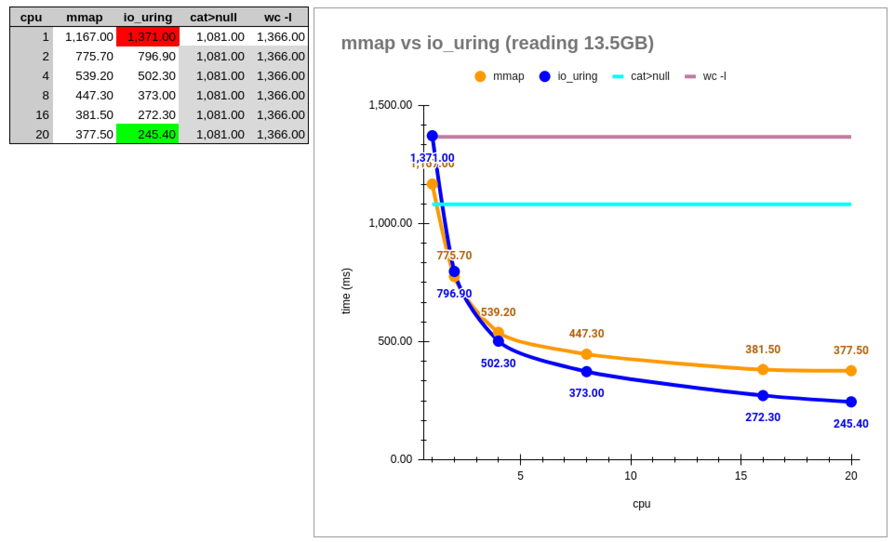

# C Implementation of "[The One Billion Row Challenge](https://github.com/gunnarmorling/1brc) "

This C implementation tackles [The One Billion Row Challenge](https://github.com/gunnarmorling/1brc) leveraging **SIMD/AVX2** optimizations along with **io_uring** and **mmap** for efficient data handling on **Linux**.  

Optimized for `12th Gen Intel i7-1280P` CPU.  

Modes:
  - **io_uring** + avx2
    - i7-1280P (20-threads): **~580 ms**
    - i7-12700H: 811 ms
  - **mmap** + avx2
    - i7-1280P (20-threads): **~625 ms**
    - i7-12700H: 862 ms 

Assumptions:
- Maximum station count (configurable): 511
- Station/city name length (configurable): 3 to 26 characters
- Station/city name hashing optimized for the provided list; adding new stations may lead to collisions; in such case, use `bin/1brc_safe` which is about ~2x slower (further optimization possible but not prioritized)...


## Benchmark

cores:               |       1      |     2        |     4        |     8      |    16      |      20    |
---------------------|--------------|--------------|--------------|------------|------------|------------|
**io_uring (clang)** |   4.575 ms   |   2.374 ms   | **1.316 ms** | **938 ms** | **640 ms** | **578 ms** |
**mmap     (clang)** | **4.031 ms** | **2.250 ms** | **1.312 ms** |   984 ms   |   692 ms   |   622 ms   |
  io_uring   (gcc)   |   4.878 ms   |   2.608 ms   |   1.443 ms   | 1.043 ms   |   703 ms   |   643 ms   |
  mmap       (gcc)   |   4.378 ms   |   2.262 ms   |   1.474 ms   | 1.079 ms   |   760 ms   |   697 ms   |


Tested on:
- Lenovo ThinkPad X1 Carbon Gen 10 14.0" 2.8K OLED i7-1280P
  - CPU: [12th Gen Intel i7-1280P (20-core) @ 4.700GHz](https://www.intel.com/content/www/us/en/products/sku/226253/intel-core-i71280p-processor-24m-cache-up-to-4-80-ghz/specifications.html)
    - 20 threads, 14 cores (6 P-core @ 4.8 GHz + 8 E-core @ 3.6 GHz)
    - 24MB Intel® Smart Cache
  - RAM: 32 GB  (~23 GB free)
  - SSD: Solidigm P44 Pro PCIe 4.0 NVMe M.2 2TB 7000 MB/s
- OS: Linux 6.8.6 x86_64 (2024-04-20), NixOS
- Tools: clang 18.1.3, gcc 13.2.0, liburing 2.5, hyperfine 1.18.0
- Best average results from 3-5 tries with "hyperfine --warmup=0 --runs=1 ..."
- After PC rebooted


**io_uring** + simd/avx2
  ```sh
    ❱ hyperfine --warmup=1 --runs=3 "bin/1brc $FULL"
    Benchmark 1: bin/1brc /home/gds/dev/BB/_data/full.txt
      Time (mean ± σ):     577.5 ms ±   3.5 ms    [User: 8908.1 ms, System: 1881.7 ms]
      Range (min … max):   573.6 ms … 580.3 ms    3 runs
  ```

**mmap** + simd/avx2
  ```sh
    ❱ hyperfine --warmup=1 --runs=3 "bin/1brc $FULL --mmap"
    Benchmark 1: bin/1brc /home/gds/dev/BB/_data/full.txt --mmap
      Time (mean ± σ):     622.0 ms ±  29.4 ms    [User: 8565.1 ms, System: 616.8 ms]
      Range (min … max):   600.4 ms … 655.4 ms    3 runs
  ```

### mmap vs io_uring (gcc)

- Tested with GCC-compiled binary
- File reading only, checks and counts new lines (similar to `wc -l`)




## Build / Run

Install `clang-18`, `gcc-13`, and `liburing` (see packages in `shell.nix` if anything is missing).  

If  nix + direnv are installed then just do `direnv allow`.  

```sh
./scripts/build.sh
./scripts/run.sh
./scripts/...sh
```

Notes:
- ***Clang provides 5-10% better results than GCC***
- if does not compile remove or change `-march=skylake` option in `makefile`


## Possible Improvements

- `IORING_SETUP_IOPOLL` with io_uring; non-functional on my system
- **AVX512** (512-bit) instead of AVX2 (256-bit); limited by hardware availability
